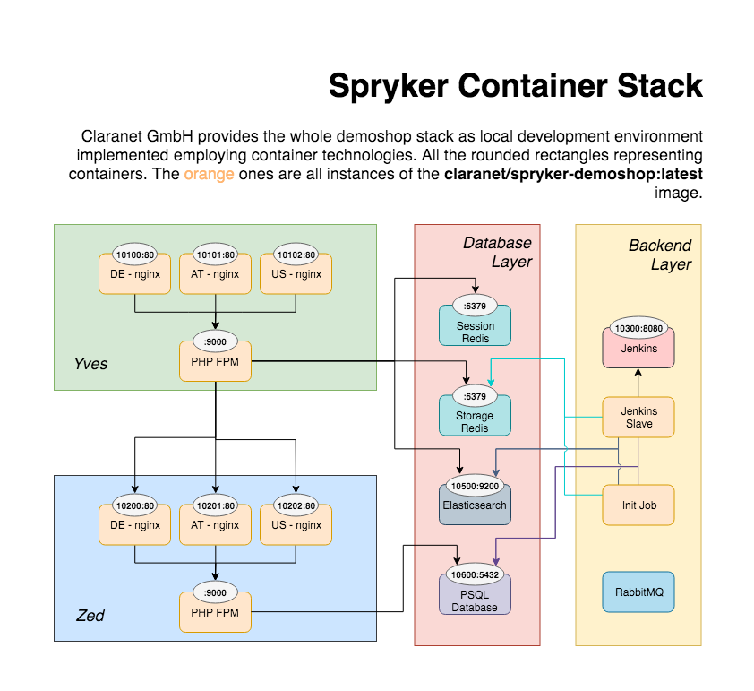

# Docker Image claranet/spryker-demoshop

<!-- vim-markdown-toc GFM -->

* [TL;DR](#tldr)
* [What?](#what)
* [Why?](#why)
* [Services](#services)
* [Design](#design)
    * [Build Time Environment](#build-time-environment)
    * [Runtime Environments](#runtime-environments)
    * [Spryker Configuration](#spryker-configuration)
    * [Docker Volumes](#docker-volumes)
* [Using the wrapper script](#using-the-wrapper-script)
    * [Build Image](#build-image)
    * [Start Development Environment](#start-development-environment)
    * [Rebuilding / Recreating](#rebuilding--recreating)
    * [Refetch Dependencies](#refetch-dependencies)
    * [Interface to `docker-compose`](#interface-to-docker-compose)
    * [Debug Failed Build](#debug-failed-build)
* [Deprecations](#deprecations)
* [Known Issues](#known-issues)
    * [PHP 7.2](#php-72)
    * [PHP OPCACHE](#php-opcache)

<!-- vim-markdown-toc -->

## TL;DR

Requires: a recent, stable version of [docker](https://docs.docker.com/) and
[docker-compose](https://docs.docker.com/compose/) (with docker-compose.yml 3.4
support) on your
[Linux](https://docs.docker.com/engine/installation/linux/ubuntu/) or
[MacOS](https://docs.docker.com/docker-for-mac/install/) system. 

Since this stack is quite complex including a fully fleged ES, it requires at
least 4GB of memory. If you are running docker on Windows/MacOS please adjust
the settings accordingly.

If requisites are met, running the shop is fairly easy. Just enter these steps:

    $ git clone https://github.com/claranet/spryker-demoshop.git
    $ cd spryker-demoshop
    $ ./docker/run devel pull
    $ ./docker/run devel up

This pulls the docker image, create a network, create all the containers, bind
mounts your local code into the container in order to enable you to live-edit
from outside, connects the container to each other and finally exposes the
public services. Like Yves, Zed, Jenkins-Master, Postgresql and Elasticsearch.

After the initialization has been finished, you are able to point your browser
to the following URLs:

* Yves: http://localhost:20100
* Zed: http://localhost:20200
* Jenkins-Master: http://localhost:20300
* Elasticsearch: http://localhost:20500
* Postgresql: localhost:20600

## What?

This is a dockerized version of the official reference implementation of the
[Spryker Demoshop](https://github.com/spryker/demoshop). It is ready to run
out-of-the-box by automatically pulling all required dependencies and creating
a stack comprising PostgreSQL, Redis, Elasticsearch and Jenkins. During runtime
each of the services gets initialized.

You can use this repository either as a demonstration for a paradigmatic shop
based on Spryker Commerce OS or as starting point for the development of
your own implementation beginning with a fork of the demoshop.

The build and start procedure along with further tooling are inherited from the
[claranet/php](https://github.com/claranet/php) image. There
you will find the technical design ideas behind this dockerization and answers
to further points like:

* Private Repositories
* Build Layer
* Environments
* `docker/` filesystem structure
* sections / subsection & steps concept

## Why?

Benefits of containerization:

* Consistency
* Reproducibility
* Portablity
* Seamless deployment form local development into prod environment

## Services

Several services are being exposed by the docker-compose stack. In order to
run stacks in parallel and prevent port collisions we need to align port
allocation.

Therefore the following scheme has been implemented: The port number is encoded
like this: **ECCDD**

* **E** - Environment
    * 1 - production
    * 2 - development
* **CC** - Component
    * 01 - yves
    * 02 - zed
    * 03 - jenkins
    * 05 - elasticsearch
    * 06 - postgresql
    * 07 - rabbitmq
* **DD** - Domain
    * 00 - DE
    * 01 - AT
    * 02 - US

So yves DE is reachable via http://localhost:20100/ and yves US via http://localhost:20102

Notice: The differentiation between stores/domains by port is only applicable to the
local devel environment. The actual production grade stack provided by Claranet
is doing this distinction based on the actual domain name.

## Design

### Build Time Environment

Another premise is - and this one is crucial for your understanding of this
stack - to build one unified image across development and production
environments. This affects the usage of `APPLICATION_ENV` which gets evaluated
by the Spryker App itself.

This variable has the following impact:

1. During Build Time:
    1. Which packages are going to be installed via dependency resolution
     (composer, npm)?
    1. Differnt modes in assets building
1. During Run Time:
    1. Where does the application is about to find configuration files (propel config)?
    1. Where are external resources to be found?
    1. Shall the app enable symfony debug/devel behaviour?

The location of local configuration files and external resources is nothing
which needs extra consideration in containerized environment, since all those
stacks are isolated anyways. ***So please ensure that no configuration
statement under `./config/Shared/` will utilize `APPLICATION_ENV` for
identifying their pathes!!!***

We consider only point 1.1 worth a distinction. And since this could be
achieved with injecting proper vars into the effective containers, we do not
distinguish between environments while building the images. Since point 1.1
requires typically more dependencies to be resolved, we always build the image
with `APPLICATION_ENV` set to `development`. But in which mode the application
actually will be ran is independant from that.

This means that even the production containers will have development dependencies
included. Primary reason for this is the requirement for dev/test/prod parity
to ensure the containers behave exactly the same in all stages and in all
environments. Tradeoff for this premise is again larger effective images.

During runtime the behaviour of the Spryker Application can be controlled by
setting `APPLICATION_ENV` which accepts either `development` or `production`.
If you use the `./docker/run` script this variables will be set automatically.

### Runtime Environments

The idea behind the wrapper script provided via `./docker/run` is
the basic distinction between `devel` and `prod` environments. The main
difference between those environments in terms of `docker-compose` is the
employment of bind mounts in the devel mode, which enables the developer to
edit the code base from the outside while running the code in the background
within the containers.

Since this setup strives for reducing manual efforts we prepared shell scripts
which render the necessary logic and support you with shortcuts for the most
common tasks like building the image or creating or tearing down the container
setup. Check out `./docker/run help`

The `prod` environment is meant for testing the result of your work in a
near-to-prod environment, which means that no shared data between your local
repository and the container will be established. Furthermore will the
application be run with `APPLICTION_ENV=production` set which disables development
specific extensions.

### Spryker Configuration

Since in a dockerized environment external services are reachable on different
addresses depending on the environment the code is running in we need some
configuration to be adjusted container spin up times. We therefore use the
Spryker native mechanism of configuration file precedence in order to inject
our configurations via the site local configuration file
`config/Shared/config_local.php`. Since this file is the one which overrides
all the others.

Configuration order is as the following (last overides prio ones):
* `config_default.php` - Base configuration
* `config_default-development.php` - Configuration relevant for development mode (see `APPLICATION_ENV`)
* `config_local.php` - site local configuration; in this case its the configuration for containerized environment.

This order enables you to use your config file completely independently of
the effective environment the shop will run in. You can even control different
behaviour between environments. We just override the so to say site local
settings, which this idea is originating from.

### Docker Volumes

Currently both environments `devel` and `prod` using unnamed volumes which is
due to the assumption of a transient environment. This means, the whole stack
gets create for the sole purpose of checking your code base aginst it. **Its is
under no circumstance meant as some production grade setup, where data needs to
persisted over recreations of containers!!!**

The assumed workflow could be described as:

1. Create environment
1. Initialize with demo data during init
1. Evolve code base
1. Iterate: rebuild -> run -> init -> evolve
1. Destroy environment including volumes

## Using the wrapper script

`docker-compose(1)` has been wrapped via the shell script `./docker/run`. This
script provides shortcuts for most of the common tasks while paying attention
to the local repository and its configuration:

### Build Image

Just to build the docker image use: `./docker/run build`

This applies to both environments since both are based of the very same image. It will
build the main spryker-demoshop image as well as a specialized jenkins-slave flavour from
the spryker-demoshop image.

### Start Development Environment

If you want to start you own work based on the demoshop you might find the
local development environment interesting. This setup enables you to mount your
local code base into a running containers and see changes to the code base take
effect immediately.

Just run `./docker/run devel up` and there you go.

Destroy devel stack including all of the allocated unnamed volumes:
`./docker/run devel down -v`

### Rebuilding / Recreating

In case you need to rebuild the shop image and just want to recreate the Yves
and/or Zed container while keeping all of the data containers (redis, es, psql)
running: `./docker/run devel rebuild`

If you just want to recreate those containers without rebuilding them run:
`./docker/run devel recreate`

While debugging it might be useful instead of letting `/entrypoints.sh`
initialize the container to skip this steps and check for yourself. You could
do this by changing the `command: run-zed` directive of the concerning
container to `command: sleep 1w` in the `docker-compose-devel.yml` and
recreate the container by running `./docker/run devel recreate zed`.

### Refetch Dependencies

Rerun the process which resolves the PHP and Node dependencies within the
running Yves/Zed containers: `./docker/run devel build-deps`

Caution: This only works if you are not using private repository and therefore
your dependencies are publicly available. Otherwise you need to rebuild the
image entirely as described above.

### Interface to `docker-compose`

Since all this is based on `docker-composer` you might need to call it by
yourself, for example to enter a container via shell:
`./docker/run devel compose exec yves bash`

### Debug Failed Build

If the output of the build is not that telling and you are in need of a deeper
debug session, consider the following steps in order to resurrect the died
intermediate build container:

    ./docker/run build
    # assumed that the last created container is the failed intermediate build container
    docker commit $(docker ps -lq) debug
    docker run --rm --it debug /bin/sh

And here you go in investigating the cause for the build failure.

## Deprecations

* We dropped alpine support in favor of debian stretch! If you require alpine,
  please use versions prior 2.28.0
* Also note: The parent image switched from `claranet/spryker-base` to
 `claranet/php`, which breaks the previous `docker/` filesystem structure!

## Known Issues

If you find a bug not listed here, please [report](https://github.com/claranet/spryker-demoshop/issues) them!

### PHP 7.2

We won't ship the demoshop until https://bugs.php.net/bug.php?id=76029 is fixed and we can enable opcache. Opcache is essential in prod environments, and it doesn't make sense to use 7.2 in dev and 7.1 in production...

### PHP OPCACHE

Since Spryker Demoshop `2.32` it seems, that there is a bug which causes the OPCACHE to throws exceptions. So we were forced to disable OPCACHE.
